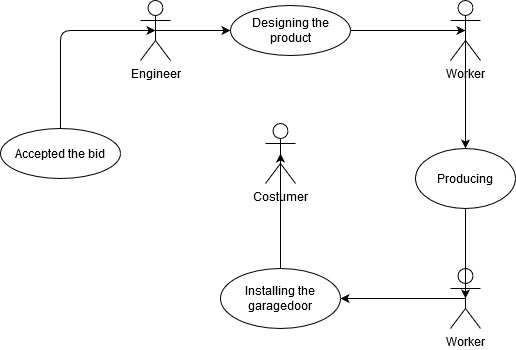

# Rendszerterv

## 1. Bevezetés
A projekt célja egy olyan webes felület létrehozása amely támogatni képes a garázskapukat gyártó és forgalmazó kisvállalkozás üzleti folyamatait. Emellet pedig ügyfélkörének bővítésére is lehetősége nyílik. A garázskapura vágyóknak nem kell böngészni az internetet és a hirdetéseket keresni hanem egy helyen érhető el minden és bármikor egy böngészőn keresztül. Így időt és energiát spórol, nem kell a nyitvatartási időt figyelemmel kísérni. Valamint a vállalkozás helyzete is leegyszerűsödik, és egyszerre több vevő igényét is ki tudják szolgálni egy időben. Egy felületen keresztül tudnak a regisztrált felhasználók rendelni, árajánlatot elfogadni. Kisvállalati oldalról pedig egy helyen láthatóak a jelenleg futó vagy már befejezett munkák. Természetesen több jogultsági szinttel rendelkezik a rendszer, így minden felhasználó csak a számára releváns műveleteket tudja elvégezni, pl.: termékek adatainak karbantartása, munkafolyamatok hozzáadása.

## 2. Projektterv
A webes alkalmazásban a supervisornak van a legnagyobb jogköre. Amíg a weboldalra látogató csak megtekintheti az elérhető garázskapukat, addig a regisztrált felhasználók rendléseket adhanak le, amikhez fényképeket is csatolhatnak. A manager tartja az ügyfelekkel a kapcsolatot. A munkások végzik a telepítéssel, szervízeléssel kapcsolatos adatok karbantartásást. A rendszer generálja le az árajánlatot, így a managernek ennek ellenőrzése és ügyintézése marad.

#### Az alkalmazáson dolgozók:
|    Név      | Szak |  Szerepkörök |
| ----------- | ----------- | ----------- |
| Sass-Gyarmati Norbert | programtervező informatikus | BackEnd, dokumentáció |
| Marton Benjámin | programtervező informatikus | BackEnd, dokumentáció |
| Soós Gergő | programtervező informatikus |  Adatbázis, dokumentáció |
| Vincze Flórián | programtervező informatikus | Frontend |
| Edina Móni | programtervező informatikus | Frontend |

## 3. Üzleti folyamatok modellje

A jelenlegi rendszerben a kisvállalkozás nem rendelkezik weboldallal ezért a helyi újságokban, rádiókban és egyéb online lehetőségek segítségével hirdetnek. Így a megrendelőnek le kell mérnie az épület azon részeit ahova a garázskaput szeretné. Ezek után az adatokkal és az eképzeléssel fel kell hívnia a kisvállalatot. A telefon mellett nem mindig található olyan munkatárs, aki biztosan fel tudja venni a megrendelést vagy kezelni tudja a felmerült problémákat. A munkák, az egyes termékekkel kapcsolatos adatok, munkafolyamatok, munkaidő beosztások nyilvántartása táblázatokban tárolódnak és papíron. Ezek rendszertelenül kerülnek egyeztetésre. Rendszerint akkor ha valamilyen hiány vagy probléma merül fel. Az árajánlat kalkulása valamint a beszerelni kívánt garázskapu paraméterein túl nincsen információjuk arról, hogy milyen adottságú helyre történik a megrendelés. Az árajánlat elfogadása után megtervezésre és legyártásra kerül a garázskapu. Ezt követően a szerelőcsapat megkezdi a beszerelést, beüzemelést. Ezek dokumentálása csúszással történik. Az utólagos reklamációk, felmerült kérdések esetleges  problémák intézésére szintén telefonon van lehetőség.

### Igényelt üzleti folyamatok modellje:

A megrendelő ügyfele otthon, vagy akár utazás közben is képes információt szeretni arról, hogy milyen garázskauk érhetők el a kínálatban. Esetleg egy kapu konfigurációt össze tud állítani és ezzel együtt árajánlatot tud kérni.  Így nem érheti meglepetés a beüzelemelést követően a számlán szereplő összeg miatt. Emellett az ügyfelek panaszt is tehetnek. A jobb kivitelezés érdekében a megrendelő fényképet is tud csatolni megrendeléséhez. A rendszer generál egy árajánlatot. Ezt vagy elfogadja a felhasználó vagy elutasítja. Amelyiben elfogadja kezdőthet a tervezés és a gyártás. A tervezéstől a kivitelezésig nyomonkövethető a termék útja így az utólag is elemezhető. A beszerelés időpontjai is megtekinthetőek valamint a munkát végző szakemberek adatai. Ezen felül a megrendelt garázskapuval kapcsolatos információkat el tudja érni a webes felületen keresztül. Így pontos információt kaphat a munka jelenlegi állapotáról. Emellett a beszerelés, beüzemelés várható időpontjával kapcsolatban is tájékozódhat.

## 4. Funkcionális leírás
Az összes ügyfél számára látható az éppen elérhető garázskapuk, valamint az összeállítás után a rendszer által generált árajánlatot elutasítják vagy elfogadják. Azonban a garázskapukkal kapcsolatos adatokat csak a supervisornak van jogosultsága módosítani. Leggyakoribb használati esetek között szerepel az ügyfelek böngészése a webshopban, illetve a munkások által elvégzett feladatok dokumentálása. Valamint az árajánlatok generálása, elfogadása és elutasítása.

## 5. Fizikai környezet
Az alkalmazás bármilyen operációs rendszeren futtatható mivel egy webes alkalmazásról van szó ezért a különböző böngészők képesek értelmezni. Ebből adódóan nem igényel hatalmas erőforrásokat. Így egy internetezésre alkalmas számitógépről/laptopról  hiba nélkül elérhető az alkalmazás.

## 6. Architektúrális terv

Az architektúrális tervnek a funkcionális követelményeken túl fontos elemét képezik a rendszer használatát befolyásoló tényezők is. Az adatok tárolását adatbázisok segítségével biztosítjuk így rugalmasság szempontjából a későbbi bővítésekre is felkészültünk. Az adatbázis további felhasználók tekintetében 10 ezer felhasználó adatainak tárolására képes. Ezen belül 100 felhasználói fiók a cég alkalmazottjai, vezetősége részére van fenntartva. Emellett valós időben 100 és 200 közötti felhasználót tud biztonságosan kezelni egyszerre. 
Erőssége az alkalmazásnak, hogy az üzemeltetése egyszerű. Az esetleges szerver meghibásodás vagy szolgáltató váltás esetén gond nélkül áthelyezhető másik állomásra. 
A mai kor elengedhetetlen követelménye a biztonság. Ezt a különböző felhasználói jogosultságokkal érhető el. Ennek köszönhetően a látogatók nem tudják a garázskapuk adatait módosítani, valamint nem férhetnek hozzá bizalmas információkhoz. A felhasználók kezelése a...-tal/tel valósul meg.
