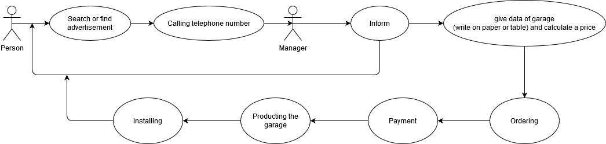

# Functional specification

## 1. The purpose of the system, not its goals
The basic goal of the system is a web-based application, with the help of which a garage door company helps everyday activities and increases its revenues. Its wide range of services can be found from order to installation, as well as service and repair. Buyers can find information, request a quote and make a complaint through this interface. Also, the individual processes become more manageable for the company, because the system can also keep records of the work. All this in one web application. This allows the customer to stay in competition with other market participants. After installing the application, the efficiency of the garage door webshop will increase. The purpose of the system is not to completely replace personal communication. The application will primarily make the work of those who work there easier.

## 2. Description of the current situation
At present, the customer does not standardize the information related to each order, the handling of problems related to customers. Separate records contain schedules of managers, designers, installers, their activity logs, and data related to each product. It is also extremely cumbersome to be able to view certain documents only on paper. Coordinating and coordinating this is extremely time consuming and requires an employee. It works but is quite slow, due to human error the chance of misunderstandings is significant. Written pages can be lost, soiled, and human writing can be unreadable to others. At the moment, people can only be informed about the changes by communicating over the phone. Again, this is only a cost to the company. Opening hours cover an extremely large time interval, yet they can be missed for orders and error handling if they occur beyond business hours. The customer is clearly inclined to damage modern solutions. That’s why he thought it was time to build the app.

# 3. Description of a dream system
The customer wants an app that would help his customers reach the garage doors they offer and ask for help without getting tired of the store. This is to ensure flexibility and speed. The software office will probably want to further develop the existing application in the future, they are currently experimenting with the extent to which they will receive positive feedback, and later the software will probably need to be expanded with other features accordingly. In addition to listing the available garage doors and parts, the customer wants to be able to get a quote quickly and easily, in case he wants to expand the offer, and he can modify the existing garage doors, remove them from the garage doors to be displayed if necessary. The system must provide a login for a user who is authorized to maintain them. It is important for him to be clear about the buttons, the fields, what, where to enter, or just where, which button to click. It supports easy operation. You don’t want to spend more work days learning to use the software. The software must be ready to be expanded with other features. Later, it is conceivable that the customer would like to offer discounts to regular customers, register them, or even automate them.

# Related tenders, laws, regulations, rules and standards
THE EUROPEAN PARLIAMENT AND THE COUNCIL 1169/2011/EU REGULATION (25th october 2011.) On the protection of individuals with regard to the processing of personal data and on the free movement of such data, and repealing Regulation (EC) No 95/46 (General Data Protection Regulation)
 THE EUROPEAN PARLIAMENT AND THE COUNCIL (EU) 2016/679 RENDELETE (27th of April 2016.)
- 2011.évi CXII. törvény – az információs önrendelkezési jogról és az információszabadságról (a továbbiakban: Infotv.)
- 2001.évi CVIII. törvény – az elektronikus kereskedelmi szolgáltatások, valamint az információs társadalommal összefüggő szolgáltatások egyes kérdéseiről (főképp a 13/A. §-a)
- 2008.évi XLVII. törvény – a fogyasztókkal szembeni tisztességtelen kereskedelmi gyakorlat tilalmáról;
- 2008.évi XLVIII. törvény – a gazdasági reklámtevékenység alapvető feltételeiről és egyes korlátairól (különösen a 6.§-a)
- 2005.évi XC. törvény az elektronikus információszabadságról
- 2003.évi C. törvény az elektronikus hírközlésről (kifejezetten a 155.§-a)
16/2011. sz. vélemény a viselkedésalapú online reklám bevált gyakorlatára vonatkozó EASA/IAB-ajánlásról
- 2006/2004/EK rendelet és a 2009/22/EK irányelv módosításáról szóló, 2013. május 21-i 524/2013/EU európai parlamenti és tanácsi rendelet szerinti tagállami online vitarendezési kapcsolattartó pont

# 5. Current business process model

Under the current system, a small business does not have a website so they advertise in local newspapers, radio and other online opportunities. Thus, the customer must weigh the parts of the building where he wants the garage door. You then need to call the small business with the data and imagination. There is not always a staff member next to the phone who can be sure to pick up the order or deal with any problems that may arise. Jobs, data related to each product, workflows, work schedule records are stored in tables and on paper. These are negotiated irregularly. Usually when there is a deficiency or problem. In addition to the calculation of the price offer and the parameters of the garage door to be installed, they do not have information on the location of the order. After accepting the order and the price offer, the product will be designed and manufactured and the assembly team will start the installation and commissioning. These are documented by sliding. It is also possible to make a subsequent complaint, question or problem by phone.

# 6. Required business process model
## Árajánlat elfogadás és fizetés
 

## Manufacture and installation of garage doors

The customer of the customer is able to love information about what kind of garages are on offer at home or even while traveling. You may be able to compile a gateway configuration and request a quote. This way, you should not be surprised by the amount on the invoice after commissioning. Customers can also make a complaint. For better execution, the customer can also attach a photo to his order. The system generates a quote. This is either accepted by the user or rejected. In which you accept you can start designing and manufacturing. From the design to the execution, the path of the product can be traced, so it can also be analyzed afterwards. The dates of the installation can also be viewed, as well as the details of the specialists performing the work. In addition, the customers are informed about the time of completion of the work and can keep in touch.

# 7. Requirements List

...

# 8. Use cases
The most common use case of the application is when users assemble garage doors and place an order through the website.
Also, during the preparation of the product, uploading and checking the individual work processes. Communication with customers is also crucial.

# 9. Compliance with how use cases cover requirements.
The user can rent cars currently available and suitable for him via the website using an email interface. That way, you don’t have to consider opening hours and can save time because you don’t have to stand in line.
The boss of the rental company can maintain the rental cars on one surface, so it becomes more convenient for her to delete, modify and add the cars available in the rental company. In addition, you can manage your rentals in one place.
The use of various functions is facilitated in all cases by a user-friendly interface.

# 10. Screen plans
Sajnos frontend hiányában ez a rész nem került kidolgozásra!

# 11. Scenarios
The customer needs a garage door. They do not have a website so you can only find out about the ads. If you know, call the phone number and inquire. There, the customer service representative informs them to measure and call again with the data. You call with the measured data. You get a quote that you either accept or don’t. If accepted, design and production will begin.

Engineers begin to design and manufacture based on parameters. This data and processes are stored in spreadsheets on the small business server, but only they view and modify them.

The installation team also stores, views and edits the installations to be performed and the records related to repairs.

The customer relations representative organizes the installation and service. It is informed about the completion of the product and informs the buyer about the price offer.

The manager maintains the technical data of the garage doors.

# 12. Function - requirement matching

...

# 13. Dictionary definitions
NodeJS: Node.js (also known as Node) is a system in which you can write server-side applications in JavaScript. The system itself is written in C / C ++ and covers an event-based I / O system over the Google V8 JavaScript engine.

MariaDB: An open source document-oriented database software developed by 10gen. It is one of the NoSQL database servers. Stores documents in JSON-like format (BSON). The most popular NoSQL database software.

JavaScript: The JavaScript programming language is an object-oriented, prototype-based scripting language widely used on web pages. The JavaScript code is either in the html file or in a separate (typically .js extension) text file. These files can be edited with any text editor (not a document editor).

JSON: JSON (JavaScript Object Notation) is a small, text-based standard for human-readable data exchange. JavaScript was developed from a scripting language to represent simple data structures and associative arrays (in JSON, their object is called). Despite its connection to JavaScript, it is language-independent and has interpreters for several languages. JSON is most often used to transfer data between a server and a client computer, as an alternative to XML. It is generally used to store and transmit structured data.

RestApi: a type of software architecture, distributed connection, for large Internet-based systems such as the World Wide Web.
