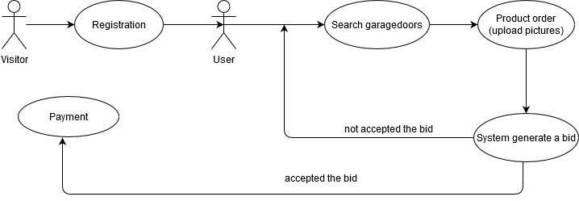

# Funkcionális specifikáció

## 1. A rendszer célja, és nem céljai
A rendszer alapvető célja egy webes felületű alkalmazás, melynek segítségével egy garázskapukkal fogalkozó vállalkozás  mindennapi tevékenységének segítése, emelett bevételeinek növelése. Széles szolgáltatásai a megrendeléstől a beépítésig megtalálhatók, illetve a szervízelés és javítás is. A vevők ezen a felületen keresztül tudnak  tájékozódni, árajánlatot kérni, reklomálni. Valamint a vállalkozás számára is átláthatóbbá válnak az egyes folymatok, mert a munkákat is nyilván tudja tartani a rendszer. Mind ezt egy webes alkalmazásban. Ennek segítségével a megrendelő versenyben tud maradni a piacon a többi részvevővel. Az alkalmazás installálása után a garázskapu webshop hatékonysága növekedni fog. A rendszernek nem célja, teljes egészében lecserélni a személyes kommunikációt. Az alkalmazás elsősorba az ott dolgozók munkáját fogja könnyebbé tenni.

## 2. Jelenlegi helyzet leírása
Jelenleg a megrendelőnél az egyes megrendelésekkel kapcsolatos információkat, a vevőkkel kapcsolatban felmerült problémák kezelése nem egységesített. Külön nyilvántartásokban találhatóak a managerek, a tervezők, szerelők időbeosztásai, tevékenységnaplójuk és az egyes termékekkel kapcsolatos adatok. Rendkívül körülményesség teszi továbbá, hogy csak papír alapon tekinthető meg egyes dokumentumok. Ezt összehangolni és koordinálni rendkívül időigényes ráadásul egy dolgozót kíván. Működik de eléggé lassú, emberi hibából adódóan a félreértések esélye jelentős. A megírt lapok elveszhetnek, szennyeződhetnek, az emberi írás mások számára olvashatatlan lehet. Az emberek jelenleg csak úgy tudnak tájékozódni az a változásokról ha telefonon kommunikálnak. Ez megint csak költséget jelent a vállalat számára. A nyitvatartási idő rendkívül nagy időintervallumot fed le, mégis megrendelésektől és hibakezelésektől eshetnek el, ha ezek a munkdaidőn túl merülnek fel. A megrendelő egyértelműen hajlik a modern megoldásokért. Ezért is gondolta úgy, hogy itt az ideje elkészíttetni ezt az alkalmazást. 

# 3. Vágyálomrendszer leírása
A megrendelő egy olyan alkalmazást szeretne ami, segítené az ő ügyfeleit abban, hogy elérjék az általuk kínált garázskapukat és segítséget tudjanak kérni anélkül, hogy befáradnának az üzletbe. Ezzel biztosítani szeretné a rugalmasságot és a gyorsaságot. A szoftver rendelője a későbbiekben valószínűleg tovább szeretné fejlesztetni a meglévő applikációt, jelenleg kísérleteznek vele, milyen mértékű pozitív visszajelzéseket kapnak. Később ennek megfelelően a szoftvert valószínűleg bővíteni kell egyéb funkciókkal. Az elérhető garázskapuk és alkatrészek listázása mellett a megrendelő szeretné, ha gyorsan, egyszerűen lehetne árajánlatot kérni. Abban az esetben, ha bővíteni szeretné a kínálatot, valamint a kiválaszott garázskapukat tudja módosítani, szükség esetén eltávolítani azokat a virtuális bevásárlókosárból. A rendszernek biztosítania kell egy olyan felhasználó bejelentkezését, aki jogosult ezeknek a karbantartására. Fontos számára, hogy egyértelműek legyenek a gombok, a mezők, mit, hova kell beírni, vagy éppen hova, melyik gombra kell kattintani. Az egyszerű kezelhetőség nagyon fontos számára. Nem szeretne több munkanapot eltölteni azzal, hogy megtanulja használni a szoftvert. A szoftvernek készen kell állnia arra, hogy bővíthető legyen, további funkciókkal. A későbbiekben elképzelhető, hogy a megrendelő szeretne a rendszeres megrendelőknek kedvezményeket nyújtani, ezeket nyilvántartani, akár automatizálni, stb.

# 4. Kapcsolódó pályázatok, törvények, rendeletek, szabályok és szabványok
AZ EURÓPAI PARLAMENT ÉS A TANÁCS 1169/2011/EU RENDELETE (2011. október 25.) A természetes személyeknek a személyes adatok kezelése tekintetében történő védelméről és az ilyen adatok szabad áramlásáról, valamint a 95/46/EK rendelet hatályon kívül helyezéséről (általános adatvédelmi rendelet) AZ EURÓPAI PARLAMENT ÉS A TANÁCS (EU) 2016/679 RENDELETE (2016. április 27.)
- 2011.évi CXII. törvény – az információs önrendelkezési jogról és az információszabadságról (a továbbiakban: Infotv.)
- 2001.évi CVIII. törvény – az elektronikus kereskedelmi szolgáltatások, valamint az információs társadalommal összefüggő szolgáltatások egyes kérdéseiről (főképp a 13/A. §-a)
- 2008.évi XLVII. törvény – a fogyasztókkal szembeni tisztességtelen kereskedelmi gyakorlat tilalmáról;
- 2008.évi XLVIII. törvény – a gazdasági reklámtevékenység alapvető feltételeiről és egyes korlátairól (különösen a 6.§-a)
- 2005.évi XC. törvény az elektronikus információszabadságról
- 2003.évi C. törvény az elektronikus hírközlésről (kifejezetten a 155.§-a)
16/2011. sz. vélemény a viselkedésalapú online reklám bevált gyakorlatára vonatkozó EASA/IAB-ajánlásról
- 2006/2004/EK rendelet és a 2009/22/EK irányelv módosításáról szóló, 2013. május 21-i 524/2013/EU európai parlamenti és tanácsi rendelet szerinti tagállami online vitarendezési kapcsolattartó pont

# 5. Jelenlegi üzleti folyamatok modellje

A jelenlegi rendszerben a kisvállalkozás nem rendelketik weboldallal ezért a helyi újságokban, rádiókban és egyéb online lehetőségek segítségével hirdetnek. Így a megrendelőnek le kell mérnie az épület azon részeit ahova a garázskaput szeretné. Ezek után az adatokkal és az elképzelésekkel fel kell hívnia a kisvállalatot. A telefon mellett nem mindig található olyan munkatárs, aki biztosan fel tudja venni a megrendelést vagy kezelni tudja a felmerült problémákat. A munkák, az egyes termékekkel kapcsolatos adatok, munkafolyamatok, munkaidő beosztások nyilvántartása táblázatokban tárolódnak és papíron. Ezek rendszertelenül kerülnek egyeztetésre. Rendszerint akkor ha valamilyen hiány vagy probléma merül fel. Az árajánlat kalkulása valamint a beszerelni kívánt garázskapu paraméterein túl nincsen információjuk arról, hogy milyen adottságú helyre történik a megrendelés. A megrendelést és az árajánlat elfogadása után megtervezésre és legyártásra kerül a termék. A szerelőcsapat megkezdi a beszerelést, beüzemelést. Ezek dokumentálása csúszással történik. Az utólagos reklomációra, felmerült kérdésre, problémára szintén csak telefonon van lehetőség.

# 6. Igényelt üzleti folyamatok modellje
## Árajánlat elfogadás és fizetés
 

## A garázskapuk legyártása és telepítése

A megrendelő ügyfele otthon, vagy akár utazás közben is képes információt kapni arról, hogy milyen garázskapuk érhetők el a kínálatban. Esetleg egy kapu konfigurációt össze tud állítani és árajánlatot is tud kérni. Így nem érheti meglepetés a beüzelemelést követően a számlán szereplő összeg miatt. Emellett az ügyfelek panaszt is tehetnek. A jobb kivitelezés érdekében a megrendelő fényképet is tud csatolni a megrendeléséhez. A rendszer generál egy árajánlatot. Ezt vagy elfogadja a felhasználó vagy elutasítja. Amelyiben elfogadja kezdőthet a tervezés és a gyártás. A tervezéstől a kivitelezésig nyomonkövethető a termék útja, így az utólag is elemezhető. A beszerelés időpontjai is megtekinthetőek valamint a munkát végző szakemberek adatai. Ezen felül a munka terjesítésének időpontjáról is tájékoztatva vannak a megrendelők és a kapcsolatot tudják tartani.

# 7. Követelménylista

|Sorszám| Követelmény neve |
|----|----|
| 1. | Felhasználók bejelentkezése |
| 1. | Felhasználók kijelentkezése |
| 2. | Felhasználók regisztrálása. |
| 3. | Garázskapuk kilistázása. |
| 4. | Garázskapuk kilistázása a regisztrált felhasználóknak. |
| 5. | Termék legyártása közbeni állapotainak nyilvántartása. |
| 6. | A csomagolt termék nyomon követése |
| 7. | A készlet beállítása sz ügyfél számára |

# 8. Használati esetek
Az alkalmazás használati esetei közül a leggyakoribb amikor a felhasználók a weboldalon keresztül garázskapukat állítanak össze és megrendelést adnak le.
Valamint a termék elkészülése során az egyes munkafolyamatok feltöltése, ellenőrzése. A vevőkkel való kommunikáció is meghatározó.

# 9. Megfeleltetés, hogyan fedik le a használati esetek a követelményeket.
A felhasználó a weboldalon keresztül egy email felület segítségével kibérelheti a jelenleg elérhető és számára megfelelő autókat. Így nem kell figyelembe vennie a nyitvatartást és időt spórolhat meg, mert nem kell sorban állni.
A kölcsönző főnöke pedig karban tudja tartani a bérelhető autókat egy felületen így az ő számára is kényelmesebbé válik a kölcsönzőben alérhető autók törlése, módosítása, felvitele. Emellett a bérléseket egy helyen tudja kezelni.
A különböző funkciók használatát minden esetben felhasználóbarát felület könnyíti meg.

# 10. Képernyőtervek
Sajnos frontend hiányában ez a rész nem került kidolgozásra!

# 11. Forgatókönyvek

Az ügyfélnek szüksége van egy garázskapura. Mivel weboldallal nem rendelkeznek így csak a hirdetésekből tud értesülni. Ha értesült felhívja a telefonszámot és érdelkődik. Ott arról tájékoztatja az ügyfelekkel foglalkozó munkatárs, hogy mérje le és telefonáljon újra az adatokkal. Az lemért adatokkal telefonál. Kap egy árajánlatot, amit vagy elfogad vagy nem. Elfogadás esetén elindul a tervezés és a gyártás.

A mérnökök megkezdik a paraméterek alapján megtervezni és legyártani. Ezeket az adatokat és a folyamatokat táblázatokban tárolják a kisvállalat szerverén, de csak ők tekintik meg és módosítják.

A szerelő csapat az elvégzendő beszereléseket és javításokkal kapcsolatos nyilvántartásokat szintén egy táblázatban tárolják, tekintik meg és szerkesztik.

Az ügyfélkapcsolati munkatárs szervezi a beszerelést, szervizelést. Tájékozódik a termék elkészültéről és tájékoztatja a vevőt az árajánlatról.

A manager karbantartja a garázskapuk technikai adatait.

# 12. Funkció – követelmény megfeleltetés

|Sorszám| Követelmény neve | Funkció neve |
|----|----|----|
| 1. | Felhasználók bejelentkezése | Login  |
| 1. | Felhasználók kijelentkezése | Logout  |
| 2. | Felhasználók regisztrálása. | Register |
| 3. | Garázskapuk kilistázása. | ListInventory |
| 4. | Garázskapuk kilistázása a regisztrált felhasználóknak. | ListInventoryForClient |
| 5. | Termék legyártása közbeni állapotainak nyilvántartása. | SetInventoryForWorkers |
| 6. | A csomagolt termék nyomon követése | TrackPackedProduct |
| 7. | A készlet beállítása sz ügyfél számára | SetInventoryForClient|

# 13. Fogalomszótár
NodeJS: A Node.js (vagy másnéven Node) egy rendszer, melyben JavaScriptben írhatunk szerver oldali alkalmazásokat. Maga a rendszer C/C++-ban íródott, és egy esemény alapú I/O rendszert takar a Google V8 JavaScript motorja felett.

MariaDB: Egy nyílt forráskódú dokumentumorientált adatbázis szoftver, amelyet a 10gen fejleszt. A NoSQL adatbázisszerverek közé tartozik. A dokumentumokat JSON-szerű formátumban tárolja (BSON). A legnépszerűbb NoSQL adatbázis szoftver.

JavaScript: A JavaScript programozási nyelv egy objektumorientált, prototípus alapú szkriptnyelv, amelyet weboldalakon elterjedten használnak. A JavaScript kód vagy a html fájlban vagy külön (jellemzően .js kiterjesztésű) szövegfájlban van. Ezek a fájlok tetszőleges szövegszerkesztő (nem dokumentumszerkesztő) programmal szerkeszthetőek.

JSON: A JSON (JavaScript Object Notation) egy kis méretű, szöveg alapú szabvány, ember által olvasható adatcserére. A JavaScript szkript nyelvből alakult ki egyszerű adatstruktúrák és asszociatív tömbök reprezentálására (a JSON-ban objektum a nevük). A JavaScripttel való kapcsolata ellenére nyelvfüggetlen, több nyelvhez is van értelmezője. A JSON-t legtöbbször egy szerver és egy kliens számítógép közti adatátvitelre használják, az XML egyik alternatívájaként. Általánosságban strukturált adatok tárolására, továbbítására szolgál.

RestApi: egy szoftverarchitektúra típus, elosztott kapcsolat, nagy, internet alapú rendszerek számára, amilyen például a világháló.
